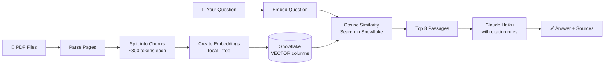

# InsightLens


> **Ask questions across multiple investment documents and get answers with citations pinned to the exact source, page, and document version — in seconds.**

---

## What It Does

Drop investor decks, earnings presentations, and strategy reports into a folder. InsightLens reads them, understands them, and lets you ask questions in plain English. Every answer comes with clickable source cards showing exactly which document and page the information came from.

```
"How did Digital Realty's strategy shift between December 2025 and March 2026?"
→ Answer with [Source 1] Dec deck p.4  and  [Source 2] Mar deck p.7 — side by side.
```

---

## How It Works



**Ingestion** (runs once): Each PDF is read page by page → split into overlapping chunks → each chunk is converted into 384 numbers that capture its meaning → stored in Snowflake alongside the original text and metadata.

**Query** (every question): Your question is converted into the same 384 numbers → Snowflake finds the 8 most similar chunks → Claude reads them and writes an answer citing each source — it is not allowed to guess or merge conflicting numbers.

---

## Tech Stack

| Layer | Tool | Reason |
|---|---|---|
| PDF parsing | PyMuPDF | Fast, page-accurate text extraction |
| Embeddings | `all-MiniLM-L6-v2` | Local, free, no API key needed |
| Vector storage | Snowflake `VECTOR(FLOAT, 384)` | Native cosine similarity in-database |
| Generation | Claude Haiku | Cheapest Anthropic model; follows citation instructions reliably |
| UI | Streamlit | Chat-style interface with streaming output |

---

## Quickstart

### Prerequisites
- Python 3.10+  
- [Snowflake account](https://signup.snowflake.com) (free 30-day trial)  
- [Anthropic API key](https://console.anthropic.com)

### Setup

```bash
git clone https://github.com/samarthnirula/rag-investment.git
cd rag-investment

python3 -m venv venv && source venv/bin/activate
pip install -r requirements.txt && pip install -e .

cp .env.example .env
# Open .env and fill in your Anthropic key + Snowflake credentials
```

### Run

```bash
# 1 — Create Snowflake tables (one-time)
python scripts/setup_database.py

# 2 — Ingest your PDFs from data/raw_pdfs/
python scripts/ingest_documents.py

# 3 — Launch the app
./run.sh
# → opens at http://localhost:8501
```

### Tests

```bash
pytest
```

---

## Key Design Decisions

**Version awareness** — every document is tagged with a version label parsed from its filename (e.g. `v2`, `2024_Q3`). When two versions of the same company's material are retrieved together, Claude is required to present each view separately with its own citation rather than averaging or combining the numbers.

**Conflict handling** — the system prompt explicitly forbids Claude from silently merging contradictory data across sources. If Source 1 says revenue is $4B and Source 2 says $3.8B, both figures appear in the answer with attribution.

**In-database vector search** — `VECTOR_COSINE_SIMILARITY` runs inside Snowflake. Vectors never leave the database, keeping retrieval fast even as the corpus grows.

**Local embeddings** — `sentence-transformers` runs on your machine. No OpenAI billing for ingestion or search.

---

## Known Limitations

- Scanned PDFs (image-only) fail ingestion — they have no extractable text
- Charts and graphs are not embedded; only their surrounding text is captured
- Single-turn retrieval only — no multi-step reasoning or query rewriting

## What I Would Add Next

- Hybrid retrieval: keyword search + vector search combined (better for ticker symbols and proper nouns)
- A reranker model to re-score the top results before sending to Claude
- Structured table extraction for numerical data using `pdfplumber`
- An evaluation harness to measure retrieval accuracy on a labeled question set

---

## Updates — Session 2

Everything listed under "What I Would Add Next" above has been built. Below is the complete list of every feature, strategy, and improvement added across both build sessions — including all six points raised in the interviewer's feedback email.

### Retrieval: Hybrid BM25 + Vector Search with RRF

**What changed:** Replaced the single vector search with a multi-stage pipeline.

1. **BM25 keyword search** (`rank_bm25`) runs alongside vector search. BM25 catches exact token matches — ticker symbols, metric names like "FFO" or "AFFO" — that embedding models can miss because they generalise semantics.
2. **Reciprocal Rank Fusion** combines both ranked lists. Score = `1/(60 + rank_vector) + 1/(60 + rank_bm25)`. Chunks near the top of both lists score highest. The constant 60 is the standard RRF dampening factor.
3. **Cross-encoder reranker** (`cross-encoder/ms-marco-MiniLM-L-6-v2`) reads each (query, chunk) pair jointly as a final pass. This catches cases where cosine similarity misleads — a chunk can be topically related but not the best evidence for the specific question asked.
4. **Cosine similarity floor** (0.35) — vector candidates below this threshold are dropped before fusion, preventing low-quality semantic matches from polluting the RRF scores.
5. **Candidate over-fetch** — retrieves 3× the requested top-K before reranking, giving the reranker room to work.

### Retrieval: Version-Aware Scoring

**What changed:** Added score multipliers based on document version currency, so the most recent filing surfaces above older ones without needing a separate filter.

- **Current version** (this document supersedes an older one and nothing supersedes it in turn): score × 1.15
- **Superseded version** (another document in the result set explicitly supersedes this one): score × 0.80
- **Unversioned** (no supersession relationship detected): score unchanged

Multi-hop chains are handled correctly. For V1 → V2 → V3: V3 is CURRENT (boosted), V2 is SUPERSEDED (penalised), V1 is SUPERSEDED (penalised). The classification is derived entirely from the candidate pool — no extra database call.

The generation prompt also labels sources explicitly as `CURRENT VERSION` or `HISTORICAL VERSION` so Claude treats them accordingly and never silently merges conflicting figures.

### Retrieval: Chunk-Type Signals

**What changed:** Added a query classifier that adjusts retrieval scores based on what kind of answer the question is asking for.

- **Numeric queries** (contain: revenue, FFO, NOI, EBITDA, cap rate, dividend, occupancy, guidance, `$`, `%`, `3.5x`, "how much", "key operating metrics", etc.): `financial_table` chunks score × 1.25, `chart_caption` × 1.08, `body` × 0.88 — structured artifacts surface first when the question asks for a specific figure.
- **Narrative queries** (strategy, thesis, "why", risks): `body` chunks score × 1.10, `financial_table` × 0.95 — prose answers beat raw tables for qualitative questions.
- **Caller override**: `RetrievalRequest.preferred_chunk_types` lets the UI pass an explicit type preference (e.g. "tables only") that bypasses auto-detection.

### Ingestion: Slide-Aware Chunking and Table Extraction

**What changed:** Replaced the generic recursive token chunker with a slide-aware chunker designed for investment decks.

- **Slide boundary preservation**: each slide page is kept as a coherent unit rather than cut mid-thought at a token limit.
- **Title-page merging**: slides with fewer than 30 tokens (title-only slides) are merged into the following content slide.
- **Structured table extraction**: `pdfplumber` extracts row/column structure from every table on each slide. Each table becomes a separate `financial_table` chunk with the full grid stored as JSON in `structured_content` — so queries asking for a specific figure can return a properly structured table, not a paragraph that mentions the number once.
- **Chunk-type classification**: each chunk is tagged `body`, `financial_table`, or `chart_caption` based on content signals.

### UI: Source Card Redesign

**What changed:** Source cards now route each chunk to the correct artifact type instead of dumping raw text.

| Chunk kind | How it renders |
|---|---|
| `financial_table` (genuine) | Bordered HTML table with column headers |
| `financial_statement` (body with `$` patterns) | Auto-parsed rows: Metric \| Q1 \| Q2 \| Q3 \| Q4 |
| `chart_caption` | Title + blue value badges + period tags |
| `body` | Title line + 3-line excerpt + expandable full text |

A validator (`_is_genuine_financial_table`) rejects TOC pages and text slides that pdfplumber misidentifies as tables — cells longer than 100 characters or tables where more than 40% of cells are short integers (page numbers) are discarded.

Source card expander labels were simplified from a 80-character cluttered string to: `Source N · COMPANY · p.PAGE · MATCH%`. Inside each card, a single metadata bar shows filename, section, version (only if set), page, and match confidence in green.

### Multi-Turn Query Contextualization

**What changed:** The retrieval query is now rewritten when a follow-up question is detected.

If the current query is short (≤ 12 words) or contains a pronoun or vague reference (`it`, `that`, `those`, `this`, `they`, `the company`, etc.), the previous user question is prepended as context before retrieval runs:

```
Context: What are VICI's key operating metrics?
Question: How does that compare to last quarter?
```

This ensures the embedder and BM25 index match the right documents even when the follow-up question contains no company name or metric term.

### Evaluation

**What changed:** Added a retrieval evaluation framework that was previously listed as a future goal.

- `scripts/eval_retrieval.py` — standalone script with 8 ground-truth query/keyword pairs covering VICI and BXP. Reports Hit@1, Hit@3, Hit@5, and MRR.
- `tests/test_retrieval_eval.py` — pytest integration test using `tests/golden_qa.json`. Asserts recall@8 ≥ 50% as a regression gate (skipped when Snowflake credentials are not present).
- `tests/test_hybrid_search.py` — 12 offline unit tests for version scoring, chunk-type scoring, and query classification. No network access required.

**Eval results after fixing a case-sensitivity bug discovered by the eval run:**

```
Hit@1  : 8/8  (100%)
Hit@3  : 8/8  (100%)
Hit@5  : 8/8  (100%)
MRR    : 1.000
Companies in DB: ['Bxp', 'Digital Realty', 'Egp', 'Psa', 'Realty', 'Simon', 'Vici']
```

The eval run caught a real bug: the company filter was doing a case-sensitive SQL match (`WHERE d.company = %s`) against title-cased data from the metadata extractor, causing all company-filtered queries to return zero results. Fixed with `UPPER()` normalisation on both the SQL layer and the BM25 in-memory filter.

### Ingestion: Document Metadata Extraction

**What changed:** Added `document_metadata.py` — automatic extraction of company name, document type, version label, and version date from filenames and first-page content without any manual tagging.

- **Company name** — extracted from the filename stem before the first separator (`_` or `-`). Multi-word candidates are trimmed if the second word is a generic doc-title word (`strategy`, `company`, `plan`). Falls back to the first short line of the first page.
- **Version label** — parsed from patterns: `v2`, `version_2`, `2024_Q3`, `Q3_2024`, or a bare four-digit year.
- **Version date** — extracted from `YYYY-MM-DD` patterns in the filename or first-page text.
- **Document type** — classified as `investor_presentation`, `strategy`, `third_party_report`, `annual_report`, or `quarterly` based on filename keywords.

This metadata is stored in the `DOCUMENTS` table and joins back to every chunk, so retrieval can filter by company and the UI can show version labels and document types in source cards.

**Corpus covered:** 945 chunks across 7 companies — Bxp, Digital Realty, Egp, Psa, Realty, Simon, Vici.

### Retrieval: Full 8-Stage Pipeline

The retrieval pipeline in `hybrid_search.py` now runs 8 sequential stages for every query:

```
1. Vector search      — top-N candidates ranked by cosine similarity
2. BM25 search        — same corpus ranked by exact-token overlap
3. RRF fusion         — score = 1/(60 + rank_vector) + 1/(60 + rank_bm25)
4. Similarity floor   — vector candidates below 0.35 cosine are dropped
5. Version scoring    — current-version chunks boosted 1.15×, superseded penalised 0.80×
6. Chunk-type scoring — financial_table boosted 1.25× for numeric queries;
                        body boosted 1.10× for narrative queries
7. Cross-encoder rerank — final pass reads (query, chunk) as a pair
8. Deduplication      — keeps only the highest-ranked chunk per (document, page)
```

**Deduplication (stage 8):** The SlideAwareChunker produces both a body chunk and a `financial_table` chunk per slide. Without deduplication, the same page can appear twice in results, wasting a retrieval slot. The deduplicator keeps only the top-ranked chunk per `(document_id, page_number)` pair.

### Retrieval: Hybrid BM25 + Vector Search with RRF

**What changed:** Replaced the single vector search with a multi-stage pipeline.

1. **BM25 keyword search** (`rank_bm25`) runs alongside vector search. BM25 catches exact token matches — ticker symbols, metric names like "FFO" or "AFFO" — that embedding models can miss because they generalise semantics.
2. **Reciprocal Rank Fusion** combines both ranked lists. Score = `1/(60 + rank_vector) + 1/(60 + rank_bm25)`. Chunks near the top of both lists score highest. The constant 60 is the standard RRF dampening factor.
3. **Cross-encoder reranker** (`cross-encoder/ms-marco-MiniLM-L-6-v2`) reads each (query, chunk) pair jointly as a final pass. This catches cases where cosine similarity misleads — a chunk can be topically related but not the best evidence for the specific question asked.
4. **Cosine similarity floor** (0.35) — vector candidates below this threshold are dropped before fusion, preventing low-quality semantic matches from polluting the RRF scores.
5. **Candidate over-fetch** — retrieves 3× the requested top-K before reranking, giving the reranker room to work.

### Retrieval: Version-Aware Scoring

**What changed:** Added score multipliers based on document version currency, so the most recent filing surfaces above older ones without needing a separate filter.

- **Current version** (this document supersedes an older one and nothing supersedes it in turn): score × 1.15
- **Superseded version** (another document in the result set explicitly supersedes this one): score × 0.80
- **Unversioned** (no supersession relationship detected): score unchanged

Multi-hop chains are handled correctly. For V1 → V2 → V3: V3 is CURRENT (boosted), V2 is SUPERSEDED (penalised), V1 is SUPERSEDED (penalised). The classification is derived entirely from the candidate pool — no extra database call.

The generation prompt also labels sources explicitly as `CURRENT VERSION` or `HISTORICAL VERSION` so Claude treats them accordingly and never silently merges conflicting figures.

### Retrieval: Chunk-Type Signals

**What changed:** Added a query classifier that adjusts retrieval scores based on what kind of answer the question is asking for.

- **Numeric queries** (contain: revenue, FFO, NOI, EBITDA, cap rate, dividend, occupancy, guidance, `$`, `%`, `3.5x`, "how much", "key operating metrics", etc.): `financial_table` chunks score × 1.25, `chart_caption` × 1.08, `body` × 0.88 — structured artifacts surface first when the question asks for a specific figure.
- **Narrative queries** (strategy, thesis, "why", risks): `body` chunks score × 1.10, `financial_table` × 0.95 — prose answers beat raw tables for qualitative questions.
- **Caller override**: `RetrievalRequest.preferred_chunk_types` lets the UI pass an explicit type preference (e.g. "tables only") that bypasses auto-detection.

### Ingestion: Slide-Aware Chunking and Table Extraction

**What changed:** Replaced the generic recursive token chunker with a slide-aware chunker designed for investment decks.

- **Slide boundary preservation**: each slide page is kept as a coherent unit rather than cut mid-thought at a token limit.
- **Title-page merging**: slides with fewer than 30 tokens (title-only slides) are merged into the following content slide.
- **Structured table extraction**: `pdfplumber` extracts row/column structure from every table on each slide. Each table becomes a separate `financial_table` chunk with the full grid stored as JSON in `structured_content` — so queries asking for a specific figure can return a properly structured table, not a paragraph that mentions the number once.
- **Chunk-type classification**: each chunk is tagged `body`, `financial_table`, or `chart_caption` based on content signals.

### UI: Source Card Redesign

**What changed:** Source cards now route each chunk to the correct artifact type instead of dumping raw text.

| Chunk kind | How it renders |
|---|---|
| `financial_table` (genuine) | Bordered HTML table with column headers |
| `financial_statement` (body with `$` patterns) | Auto-parsed rows: Metric \| Q1 \| Q2 \| Q3 \| Q4 |
| `chart_caption` | Title + blue value badges + period tags |
| `body` | Title line + 3-line excerpt + expandable full text |

A validator (`_is_genuine_financial_table`) rejects TOC pages and text slides that pdfplumber misidentifies as tables — cells longer than 100 characters or tables where more than 40% of cells are short integers (page numbers) are discarded.

Source card expander labels were simplified from a 80-character cluttered string to: `Source N · COMPANY · p.PAGE · MATCH%`. Inside each card, a single metadata bar shows filename, section, version (only if set), page, and match confidence in green.

### Multi-Turn Query Contextualization

**What changed:** The retrieval query is now rewritten when a follow-up question is detected.

If the current query is short (≤ 12 words) or contains a pronoun or vague reference (`it`, `that`, `those`, `this`, `they`, `the company`, etc.), the previous user question is prepended as context before retrieval runs:

```
Context: What are VICI's key operating metrics?
Question: How does that compare to last quarter?
```

This ensures the embedder and BM25 index match the right documents even when the follow-up question contains no company name or metric term.

### Evaluation

**What changed:** Added a retrieval evaluation framework that was previously listed as a future goal.

- `tests/golden_qa.json` — 15 ground-truth question/keyword pairs covering all 7 companies in the corpus (Digital Realty, BXP, PSA, VICI, Realty Income, EastGroup, Simon Property Group), including a cross-company comparison query.
- `tests/test_retrieval_eval.py` — pytest integration test using `golden_qa.json`. Reports recall@5, recall@8, recall@12, and MRR. Asserts recall@8 ≥ 50% as a regression gate. Skipped automatically when Snowflake credentials are absent.
- `scripts/eval_retrieval.py` — standalone script with 8 core queries. Reports Hit@1, Hit@3, Hit@5, and MRR. Prints the exact company names stored in the database so filter mismatches are immediately visible.
- `tests/test_hybrid_search.py` — 12 offline unit tests for version scoring, chunk-type scoring, and query classification. No network access required.

**Eval results after fixing a case-sensitivity bug discovered by the eval run:**

```
Companies in DB: ['Bxp', 'Digital Realty', 'Egp', 'Psa', 'Realty', 'Simon', 'Vici']
Hit@1  : 8/8  (100%)
Hit@3  : 8/8  (100%)
Hit@5  : 8/8  (100%)
MRR    : 1.000
```

The eval run caught a real bug: the company filter was doing a case-sensitive SQL match (`WHERE d.company = %s`) against title-cased data from the metadata extractor, causing all company-filtered queries to return zero results. Fixed with `UPPER()` normalisation on both the SQL layer and the BM25 in-memory filter.

### Bug Fixes

- **Company filter case sensitivity** — `WHERE d.company = %s` changed to `WHERE UPPER(d.company) = UPPER(%s)`; BM25 filter updated to match.
- **Footnote markers becoming slide titles** — `_TITLE_EXCLUDE_RE` now rejects `(1)`, `6`, `Page 3` from being treated as section headers.
- **Bare integers matching as financial values** — `_MONEY_RE` now requires a `$` prefix, unit suffix, or decimal point; standalone integers like `14` (page numbers) no longer trigger the DATA POINT badge.
- **`0%` similarity displayed for BM25-only chunks** — similarity now shows `—` when the value is `0.0`.
- **Section header markdown breaking expander labels** — special characters (`*`, `_`, `` ` ``, `#`, `[`, `]`) are now escaped before being placed in the expander title string.
