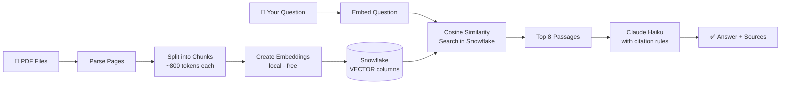

# InsightLens


> **Ask questions across multiple investment documents and get answers with citations pinned to the exact source, page, and document version — in seconds.**

---

## What It Does

Drop investor decks, earnings presentations, and strategy reports into a folder. InsightLens reads them, understands them, and lets you ask questions in plain English. Every answer comes with clickable source cards showing exactly which document and page the information came from.

```
"How did Digital Realty's strategy shift between December 2025 and March 2026?"
→ Answer with [Source 1] Dec deck p.4  and  [Source 2] Mar deck p.7 — side by side.
```

---

## How It Works



**Ingestion** (runs once): Each PDF is read page by page → split into overlapping chunks → each chunk is converted into 384 numbers that capture its meaning → stored in Snowflake alongside the original text and metadata.

**Query** (every question): Your question is converted into the same 384 numbers → Snowflake finds the 8 most similar chunks → Claude reads them and writes an answer citing each source — it is not allowed to guess or merge conflicting numbers.

---

## Tech Stack

| Layer | Tool | Reason |
|---|---|---|
| PDF parsing | PyMuPDF | Fast, page-accurate text extraction |
| Embeddings | `all-MiniLM-L6-v2` | Local, free, no API key needed |
| Vector storage | Snowflake `VECTOR(FLOAT, 384)` | Native cosine similarity in-database |
| Generation | Claude Haiku | Cheapest Anthropic model; follows citation instructions reliably |
| UI | Streamlit | Chat-style interface with streaming output |

---

## Quickstart

### Prerequisites
- Python 3.10+  
- [Snowflake account](https://signup.snowflake.com) (free 30-day trial)  
- [Anthropic API key](https://console.anthropic.com)

### Setup

```bash
git clone <repo-url>
cd rag-investment

python3 -m venv venv && source venv/bin/activate
pip install -r requirements.txt && pip install -e .

cp .env.example .env
# Open .env and fill in your Anthropic key + Snowflake credentials
```

### Run

```bash
# 1 — Create Snowflake tables (one-time)
python scripts/setup_database.py

# 2 — Ingest your PDFs from data/raw_pdfs/
python scripts/ingest_documents.py

# 3 — Launch the app
./run.sh
# → opens at http://localhost:8501
```

### Tests

```bash
pytest
```

---

## Key Design Decisions

**Version awareness** — every document is tagged with a version label parsed from its filename (e.g. `v2`, `2024_Q3`). When two versions of the same company's material are retrieved together, Claude is required to present each view separately with its own citation rather than averaging or combining the numbers.

**Conflict handling** — the system prompt explicitly forbids Claude from silently merging contradictory data across sources. If Source 1 says revenue is $4B and Source 2 says $3.8B, both figures appear in the answer with attribution.

**In-database vector search** — `VECTOR_COSINE_SIMILARITY` runs inside Snowflake. Vectors never leave the database, keeping retrieval fast even as the corpus grows.

**Local embeddings** — `sentence-transformers` runs on your machine. No OpenAI billing for ingestion or search.

---

## Known Limitations

- Scanned PDFs (image-only) fail ingestion — they have no extractable text
- Charts and graphs are not embedded; only their surrounding text is captured
- Single-turn retrieval only — no multi-step reasoning or query rewriting

## What I Would Add Next

- Hybrid retrieval: keyword search + vector search combined (better for ticker symbols and proper nouns)
- A reranker model to re-score the top results before sending to Claude
- Structured table extraction for numerical data using `pdfplumber`
- An evaluation harness to measure retrieval accuracy on a labeled question set
